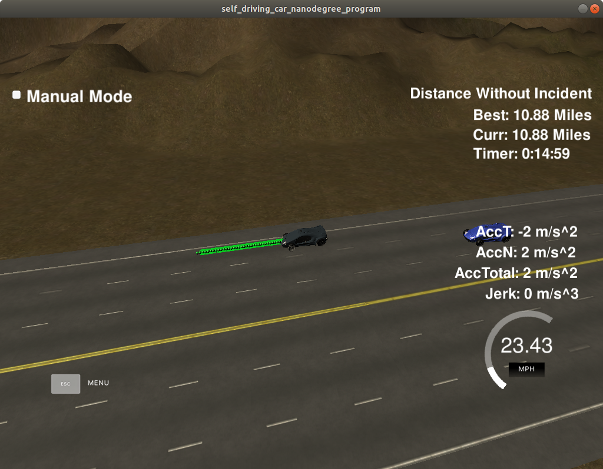

# CarND-Path-Planning-Project
Self-Driving Car Engineer Nanodegree Program
   
### Simulator.
You can download the Term3 Simulator which contains the Path Planning Project from the [releases tab (https://github.com/udacity/self-driving-car-sim/releases/tag/T3_v1.2).  

To run the simulator on Mac/Linux, first make the binary file executable with the following command:
```shell
sudo chmod u+x {simulator_file_name}
```

### Goals
In this project your goal is to safely navigate around a virtual highway with other traffic that is driving +-10 MPH of the 50 MPH speed limit. You will be provided the car's localization and sensor fusion data, there is also a sparse map list of waypoints around the highway. The car should try to go as close as possible to the 50 MPH speed limit, which means passing slower traffic when possible, note that other cars will try to change lanes too. The car should avoid hitting other cars at all cost as well as driving inside of the marked road lanes at all times, unless going from one lane to another. The car should be able to make one complete loop around the 6946m highway. Since the car is trying to go 50 MPH, it should take a little over 5 minutes to complete 1 loop. Also the car should not experience total acceleration over 10 m/s^2 and jerk that is greater than 10 m/s^3.

#### The map of the highway is in data/highway_map.txt
Each waypoint in the list contains  [x,y,s,dx,dy] values. x and y are the waypoint's map coordinate position, the s value is the distance along the road to get to that waypoint in meters, the dx and dy values define the unit normal vector pointing outward of the highway loop.

The highway's waypoints loop around so the frenet s value, distance along the road, goes from 0 to 6945.554.

## Basic Build Instructions

1. Clone this repo.
2. Make a build directory: `mkdir build && cd build`
3. Compile: `cmake .. && make`
4. Run it: `./path_planning`.

Here is the data provided from the Simulator to the C++ Program

#### Main car's localization Data (No Noise)

["x"] The car's x position in map coordinates

["y"] The car's y position in map coordinates

["s"] The car's s position in frenet coordinates

["d"] The car's d position in frenet coordinates

["yaw"] The car's yaw angle in the map

["speed"] The car's speed in MPH

#### Previous path data given to the Planner

//Note: Return the previous list but with processed points removed, can be a nice tool to show how far along
the path has processed since last time. 

["previous_path_x"] The previous list of x points previously given to the simulator

["previous_path_y"] The previous list of y points previously given to the simulator

#### Previous path's end s and d values 

["end_path_s"] The previous list's last point's frenet s value

["end_path_d"] The previous list's last point's frenet d value

#### Sensor Fusion Data, a list of all other car's attributes on the same side of the road. (No Noise)

["sensor_fusion"] A 2d vector of cars and then that car's [car's unique ID, car's x position in map coordinates, car's y position in map coordinates, car's x velocity in m/s, car's y velocity in m/s, car's s position in frenet coordinates, car's d position in frenet coordinates. 

## Details

1. The car uses a perfect controller and will visit every (x,y) point it recieves in the list every .02 seconds. The units for the (x,y) points are in meters and the spacing of the points determines the speed of the car. The vector going from a point to the next point in the list dictates the angle of the car. Acceleration both in the tangential and normal directions is measured along with the jerk, the rate of change of total Acceleration. The (x,y) point paths that the planner recieves should not have a total acceleration that goes over 10 m/s^2, also the jerk should not go over 50 m/s^3. (NOTE: As this is BETA, these requirements might change. Also currently jerk is over a .02 second interval, it would probably be better to average total acceleration over 1 second and measure jerk from that.

2. There will be some latency between the simulator running and the path planner returning a path, with optimized code usually its not very long maybe just 1-3 time steps. During this delay the simulator will continue using points that it was last given, because of this its a good idea to store the last points you have used so you can have a smooth transition. previous_path_x, and previous_path_y can be helpful for this transition since they show the last points given to the simulator controller with the processed points already removed. You would either return a path that extends this previous path or make sure to create a new path that has a smooth transition with this last path.

## Tips

A really helpful resource for doing this project and creating smooth trajectories was using http://kluge.in-chemnitz.de/opensource/spline/, the spline function is in a single hearder file is really easy to use.

---

## Dependencies

* cmake >= 3.5
  * All OSes: [click here for installation instructions](https://cmake.org/install/)
* make >= 4.1
  * Linux: make is installed by default on most Linux distros
  * Mac: [install Xcode command line tools to get make](https://developer.apple.com/xcode/features/)
  * Windows: [Click here for installation instructions](http://gnuwin32.sourceforge.net/packages/make.htm)
* gcc/g++ >= 5.4
  * Linux: gcc / g++ is installed by default on most Linux distros
  * Mac: same deal as make - [install Xcode command line tools]((https://developer.apple.com/xcode/features/)
  * Windows: recommend using [MinGW](http://www.mingw.org/)
* [uWebSockets](https://github.com/uWebSockets/uWebSockets)
  * Run either `install-mac.sh` or `install-ubuntu.sh`.
  * If you install from source, checkout to commit `e94b6e1`, i.e.
    ```
    git clone https://github.com/uWebSockets/uWebSockets 
    cd uWebSockets
    git checkout e94b6e1
    ```

## Editor Settings

We've purposefully kept editor configuration files out of this repo in order to
keep it as simple and environment agnostic as possible. However, we recommend
using the following settings:

* indent using spaces
* set tab width to 2 spaces (keeps the matrices in source code aligned)

## Code Style

Please (do your best to) stick to [Google's C++ style guide](https://google.github.io/styleguide/cppguide.html).

## Project Instructions and Rubric

Note: regardless of the changes you make, your project must be buildable using
cmake and make!


## Call for IDE Profiles Pull Requests

Help your fellow students!

We decided to create Makefiles with cmake to keep this project as platform
agnostic as possible. Similarly, we omitted IDE profiles in order to ensure
that students don't feel pressured to use one IDE or another.

However! I'd love to help people get up and running with their IDEs of choice.
If you've created a profile for an IDE that you think other students would
appreciate, we'd love to have you add the requisite profile files and
instructions to ide_profiles/. For example if you wanted to add a VS Code
profile, you'd add:

* /ide_profiles/vscode/.vscode
* /ide_profiles/vscode/README.md

The README should explain what the profile does, how to take advantage of it,
and how to install it.

Frankly, I've never been involved in a project with multiple IDE profiles
before. I believe the best way to handle this would be to keep them out of the
repo root to avoid clutter. My expectation is that most profiles will include
instructions to copy files to a new location to get picked up by the IDE, but
that's just a guess.

One last note here: regardless of the IDE used, every submitted project must
still be compilable with cmake and make./

---
## WriteUp Explanation

Here are the targets achieved -

**1. The car is able to drive at least 4.32 miles without incident.**

    Yes. I tested the code for a distance of about 15 miles and the car is able to complete the lap without any incident. As can be seen from the image below, the car has completed about 10.88 miles in 15 minutes with a speed of 10.88 * 4 = 43.52 mph.



**2. The car drives according to the speed limit.**

    The car is able to drive most of the track as per the speed limit unless slowed down by a slow moving vehicle in its path and unsafe overtaking conditions.

**3. Max Acceleration and Jerk are not Exceeded.**

    The maximum accleration and jerk values are never exceeded. Even in special cases such as random lane changes of other vehicles, the ego vehicle doesn't cross its deceleration threshold value.

**4. Car does not have collisions.**

    Car does not have collisions in most of the cases except in the remote chance when the other vehicle changes lanes into ego vehicle's lane at the last moment since the car is not programmed for evasive manuevers.

**5. The car stays in its lane, except for the time between changing lanes.**

    The car stays in its lane almost always except when changing lanes. The code takes care of this when generating its trajectory.

**6. The car is able to change lanes.**

    The car changes its lanes smoothly without spending more than 3 seconds outside lane. The car also moves back to center lane if no other obstacles exist in its path.

---
## Project Reflection

Since the overall code is short, I have not written separate functions for executing prediction and planning functionalities. This helps in avoiding creating unnecessary complications such as passing variable values/references to other functions. It avoids the chances of mistakes/bugs and also saves memory considerably.

We will divide the code in three sections mainly Trajectory Generation, Tracking (Prediction) and Behavior Planning.

We will discuss these sections one by one now -

<span style="font-size:1.8em;">1. Trajectory Generation</span>

Inside data/highway_map.csv there is a list of waypoints that go all the way around the track. The track contains a total of 181 waypoints, with the last waypoint mapping back around to the first. The waypoints are in the middle of the double-yellow dividing line in the center of the highway.

Each waypoint has an (x,y) global map position, and a Frenet s value and Frenet d unit normal vector (split up into the x component, and the y component). The s value is the distance along the direction of the road. The first waypoint has an s value of 0 because it is the starting point.

We use the [spline](https://kluge.in-chemnitz.de/opensource/spline/) tool to interpolate the location of points between the known waypoints. This will ensure a smooth trajectory generation.

The basic trajectory which gets the car moving is given below. This has been commented out in the code since we will use a more advanced trajectory generation method (which takes care of acceleration and jerk thresholds).

```C++
/*
// basic run check to see how car runs around the track
vector<double> next_x_vals;
vector<double> next_y_vals;

double dist_inc = 0.4;
for (int i = 0; i < 50; i++)
{
  double next_s = car_s+(i+1)*dist_inc;
  double next_d = 6;
  vector<double> xy = getXY(next_s, next_d, map_waypoints_s,map_waypoints_x, map_waypoints_y);

  next_x_vals.push_back(xy[0]);
  next_y_vals.push_back(xy[1]);
}
*/
```
As we can see above, we calculate the next s and next d values depending on the waypoints provided to us. For a distance increment of 0.4, we calculate the 50 values of x and y for the ego vehicle as the trajectory.

Note: Important !!! This code is simply to get the car moving without any lane changes or acceleration/jerk values.

The actual code which ensures smooth acceleration and minimal jerk is given above it from lines 331-467.
We use the last two points of the previous planned trajectory are used to initialize the spline calculations (347-377). We also convert the coordinates to local co-ordinates for ease of calculations and again to global later. We use the previous two points that make the path tangent to the previous path's end point (lines 367-371). For smooth transition between previous and current trajectories, we use the spline tool. Using Frenet coordinates, we add evenly spaced points at a distance of 30m ahead of starting reference. This adds three more waypoints in between the two main waypoints. See the code below -

```C++
vector<double> next_wp0 = getXY(car_s+30,(2+4*ego_lane), map_waypoints_s, map_waypoints_x, map_waypoints_y);
vector<double> next_wp1 = getXY(car_s+60,(2+4*ego_lane), map_waypoints_s, map_waypoints_x, map_waypoints_y);
vector<double> next_wp2 = getXY(car_s+90,(2+4*ego_lane), map_waypoints_s, map_waypoints_x, map_waypoints_y);

ptsx.push_back(next_wp0[0]);
ptsx.push_back(next_wp1[0]);
ptsx.push_back(next_wp2[0]);

ptsy.push_back(next_wp0[1]);
ptsy.push_back(next_wp1[1]);
ptsy.push_back(next_wp2[1]);
```

Using 50 points for planning the trajectory, depending on other vehicles, we calculate the points based on the refresh interval of 0.02 seconds.

---

<span style="font-size:1.8em;">2. Tracking and Prediction</span>

This section precedes all other sections of our code since tracking and prediction always comes before behavior planning and trajectory generation. This part of the code is between lines 132-268.

It's important that the car doesn't crash into any of the other vehicles on the road, all of which are moving at different speeds around the speed limit and can change lanes.

The sensor_fusion variable contains all the information about the cars on the right-hand side of the road.

The data format for each car is: [id, x, y, vx, vy, s, d]. The id is a unique identifier for that car. The x, y values are in global map coordinates, and the vx, vy values are the velocity components, also in reference to the global map. Finally s and d are the Frenet coordinates for that car.

The vx, vy values are used for predicting where the cars will be in the future. For instance, if you were to assume that the tracked car kept moving along the road, then its future predicted Frenet s value will be its current s value plus its (transformed) total velocity (m/s) multiplied by the time elapsed into the future (s).

**We define a parameter *car_in_lane* that checks for slow moving vehicle in ego vehicle's lane and other parameters like *right_lane_car* and *left_lane_car* which help us in planning the behavior.** (See lines 139-141)

For each car, we calculate the distance to the ego vehicle and if the distance is less than 30 m, we check the other lanes for overtaking opprtunities.

1. Based on the d co-ordinate, we assign lane number to all the vehicles and based on the vx, vy and s values, we calculate the states of all other vehicles. The following code shows how we calculate the projected distance and speed of other vehicles based on the sensor fusion data. We calculate the projected distance value using the previous number of points and vehicle speed.

```C++
// get the velocities of the i car in x and y directions
double vx = sensor_fusion[i][3];
double vy = sensor_fusion[i][4];

// get the speed value using the distance formula
double check_speed = sqrt(vx*vx + vy*vy);
// check the car's s value
double check_car_s = sensor_fusion[i][5];

// if using previous points, can project s value
check_car_s += ((double)prev_size*0.02*check_speed);
```

2. If a vehicle is detected at a distance of less than 30 m and in the ego vehicle's path, we set the parameter *car_in_lane* to *true*. We also calculate the projected s value of the car depending on the number of points and the refresh time.

3. We also check the surrounding lanes for any vehicles at a distance of +/- 30 meters and accordingly set the parameters for *left_lane_car* and *right_lane_car*. These parameters will help us to make overtaking decisions in the behavior planning and execution phase.

4. For vehicles changing lanes randomly, we also define one more parameter *too_close* which increases braking to compensate for shorter slowing distances.

---

<span style="font-size:1.8em;">3. Behavior Planning and Control</span>

When there is a car detected in our lane, we have three options. We explain each of these options below -

## Left lane change

The ego vehicle executes a left lane change whenever we detect a slow moving vehicle in front of the ego vehicle (i.e. when the parameter *car_in_lane* is TRUE). The left lane change is executed only if 1)the car is not in the leftmost lane already and 2)if the left lane is clear of any approaching vehicles or blocking vehicles.

```C++
// check if there is no car on left and ego vehicle lane is not in the leftmost lane
if (ego_lane > 0 && left_lane_car == false)
// if ((ego_lane > 0) && (left_lane_car_in_front == false) && (left_lane_car_behind == false))
{
  // make a left lane change
  ego_lane--;
  std::cout<<"Change to left lane "<<ego_lane<<"..."<<std::endl;
}
```

## When a car is detected in Ego vehicle's path
### Right lane change

The ego vehicle executes a right lane change whenever we detect a slow moving vehicle in front of the ego vehicle (i.e. when the parameter *car_in_lane* is TRUE). The right lane change is executed only if 1)left lane change is not possible, 2)the car is not in the rightmost lane already and 3)if the right lane is clear of any approaching vehicles or blocking vehicles.

```C++
// check if there is no car on right and tgat 
else if (ego_lane != 2 && right_lane_car == false)
// else if ((ego_lane > 0) && (right_lane_car_in_front == false) && (right_lane_car_behind == false))
{
  // make a right lane change
  ego_lane++;
  std::cout<<"Change to right lane "<<ego_lane<<"..."<<std::endl;
}
```

### Slow Down and Track preceding vehicle

The ego vehicle executes this as a last option if both the left and right lane changes are not possible due to other vehicles or if the vehicle is already in the boundary lanes. In this option, the vehicle will slow down if the distance between the ego vehicle and the preceding vehicle is less than 30 m.

We define a new acceleration parameter on line 290 *acc_val*. This parameter is calculated based on the distance of the preceding vehicle from the ego vehicle.

```C++
// this parameter will define the rate of acceleration or deceleration
double acc_val = ((30-track_dist)/30) * max_acc;
```
Hence, as can be seen from the formula, the maximum deceleration that is applied is always less than the threshold *max_acc* specified. This way, the ego vehicle automatically increases braking power as the distance between itself and the preceding vehicle reduces.

Also, if the preceding vehicle is moving away from the ego vehicle (i.e. it is faster than the ego vehicle) or when the distance between them is between 25-35 meters. This way, when there are no overtaking options available, we simply track the preceding vehicle at a distance of 25-35m till one of the adjacent lanes is available for overtaking.

```C++
// case when overtaking is not possible due to both surrounding lanes occupied by other vehicles 
else if ((ego_vel < track_vel) || ((track_dist > 25 && track_dist < 35)))
{
  // accelerate
  speed_diff += 1.5*max_acc;
  // speed_diff += acc_val2;
}
```
We have defined a parameter *too_close* as mentioned above. If the distance between the ego and the preceding vehicle falls below 15m (when too close), we apply additional braking power to slow the vehicle down further. This way, the collision can be avoided. I added this parameter when I noticed some vehicles randomly moving in the ego vehicle's path without allowing ego vehicle sufficient time to slowdown or change the lanes.

```C++
// emergency brake if some other vehicle cuts lanes
// this will cause a net max deceleration of 1.5 * max acceleration value set
if (too_close)
{
  std::cout<<"Too close, hard brake!!!\r";
  speed_diff -= (0.75*max_acc);
}
```

## When there is no obstacle

When there is no obstacle in ego vehicle's path, we execute the following.

We check if the ego vehicle is not in the center lane, we check the surrounding lanes for any approaching vehicles and execute a lane change to center lane.

```C++
// check that we are not on the center lane
if (ego_lane != 1)
{
  // if there is no car in either lanes in proximity
  if ((ego_lane == 0 && !right_lane_car) || (ego_lane == 2 && !left_lane_car))
  {
    // move back to center lane
    ego_lane = 1;
    std::cout<<"Moving back to center lane ..."<<std::endl;
  }
}
```

We also check to see if the ego vehicle is not going at the max speed. This way, the ego vehicle accelerates back to maximum speed in case of clear path.

```C++
// accelerate if no obstacle in front and speed is less than the speed limit
if (ego_vel < max_vel)
{
  // accelerate faster 
  ego_vel += 1.25 * max_acc;
}
```

---